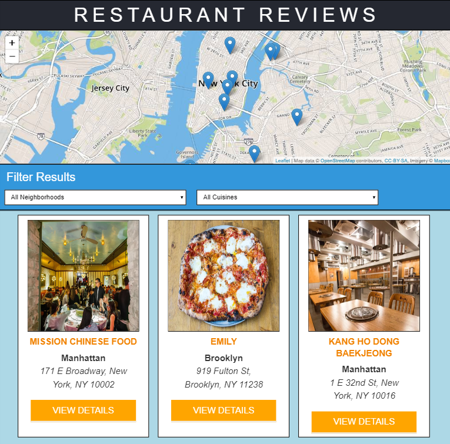

# Restaurant Reviews App 

This project is a simple single-page application that allows users to select a residential area in New York City and view a list of nearby restaurants. For each restaurant in the application, the application includes a map highlighting the restaurant's location (powered by Mapbox), a set of recent user reviews, and an assortment of details about food selection/hours.

# Other Contributors

Starter HTML / CSS / JS code and default artwork (including images, styling, and symbols) taken from the [Udacity classroom repository](https://github.com/udacity/mws-restaurant-stage-1.git).

 
